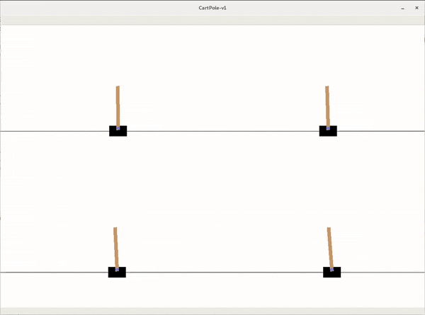
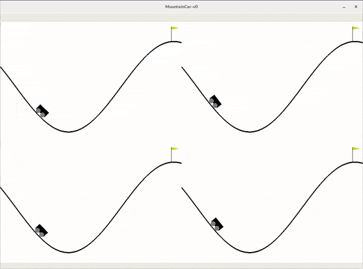
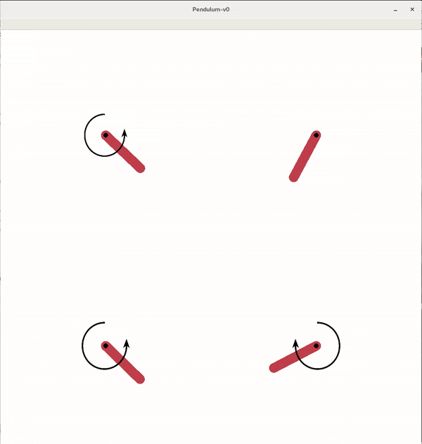
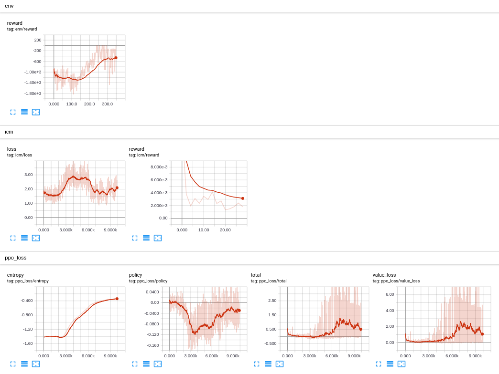

# Proximal Policy Optimization(PPO) in PyTorch

This repository contains implementation of reinforcement learning algorithm called Proximal Policy Optimization(PPO).
It also implements Intrinsic Curiosity Module(ICM).

|  CartPole-v1 (PPO)                         |  MountainCar-v0 (PPO + ICM)                      |  Pendulum-v0 (PPO + ICM)                   |
|:------------------------------------------:|:------------------------------------------------:|:------------------------------------------:|
|  |  |  |

## What is PPO

PPO is an online policy gradient algorithm built with stability in mind. It optimizes clipped surrogate function
to make sure new policy is close to the previous one.

Since it's online algorithm it uses the experience gathered to update the policy and then discards the experience(there
is no replay buffer), because of that it does well in environments that has dense reward like `CartPole-V1` where you
get the reward immediately, but it struggles to learn the policy for the environments with sparse reward like
`MountainCar-v0` where we get the positive reward only when we reach the top which is a rare event. For a offline
algorithms like DQN it is much easier to solve sparse reward problems, because of the fact they can store this
rare events in the replay buffer and use it multiple times for training.

In order to make the learning of sparse reward problems easier we need to introduce the curiosity concept

## What is curiosity

Curiosity is the concept of calculating additional reward for agent called intrinsic reward apart from the reward
from the environment itself called extrinsic reward. There are many ideas of how to define the curiosity, but in this
project the idea of Intrinsic Curiosity Module(ICM) is used. Authors define the curiosity as a measure of suprise the
encountered state brings to the agent. They achieve that by encoding the states into the latent vector and then
implementing two models. The forward model that given the encoded state and the action predicts the next state and the
inverse model that given encoded state and encoded next state tries to predict the action that must have been taken to
transit from one state to the other. The intrinsic reward is calculated as a distance between the actual encoded next
state vector and the forward model's prediction of the next state. One may wonder what is the inverse model for if it's
not used for calculating the reward. The authors explain that with the example of the agent exploring the environment
and seeing the tree with the leafs moving in the wind. The leafs are out of agent's control, but still he would be
curious about them. To avoid it the inverse model was introduced that makes sure agent is curious about states he have
the control of.

## How to run

First make sure to install all dependencies listed in the `requirements.txt`. Then run one of the following or use them
as an example to run the algorithm on any other environment:
 * CartPole-v1 `python run_cartpole.py`
 * MountainCar-v0 `python run_mountain_car.py`
 * Pendulum-v0 `python run_pendulum.py`

## Implementation details

The agent(`PPO`) explores(`Runner`) multiple environments at once(`MultiEnv`) for a specified number of steps.
If the `Curiosity` was plugged in the reward is augmented with the intrinsic reward from the curiosity module. If the
`normalize_state` or `normalize_reward` is enabled the normalization is performed(`Normalizer`) on the states and
rewards respectively. Then the discounted reward(`Reward`) and discounted advantage(`Advantage`) is calculated
on the rewards gathered. That data is split into `n_mini_batches` and used to perform `n_optimization_epochs` of
training with Adam optimizer using `learning_rate`. Most of the classes accept the `Reporter` argument which can be used
to plug in the `TensorBoardReporter` used to publish data to tensorboard for live tracking of the learning progress.

## Normalize or not

Normalization may help on some complicated continous problems like `Pendulum-v0`, but may hurt the performance on
the simple discrete environments like `CartPole-v1`. 

## TODO

- [ ] Early stopping
- [ ] Model saving
- [ ] CNN
- [ ] LSTM

## References

1. [Proximal Policy Optimization Algorithms](https://arxiv.org/abs/1707.06347)
2. [Curiosity-driven Exploration by Self-supervised Prediction](https://arxiv.org/abs/1705.05363)
3. [High-Dimensional Continuous Control Using Generalized Advantage Estimation](https://arxiv.org/abs/1506.02438)